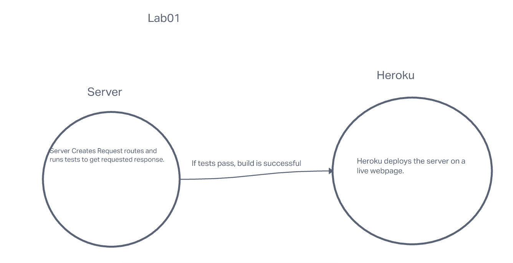

# server_deployment_practice

## Live Deployment

[Heroku Deployment for Dev Branch](https://amy401-devserdeploypractice.herokuapp.com/)
[Heroku Deployment for Main Branch](https://dashboard.heroku.com/apps/amy401-serverdeploymentpractic)

## Deployment

### How do I install the app or library
Reproduce the starter code and then install the dependencies.

### How do I test the app or library?

Run NPM test in the terminal once all dependencies are installed.

### How do I run the application?
In my local terminal and on Heroku.

## Testing 

Write a complete set of tests for all functional units and modules. Your tests must be running green on GitHub Actions.
[Tests](./__tests__/)

## Documentation

